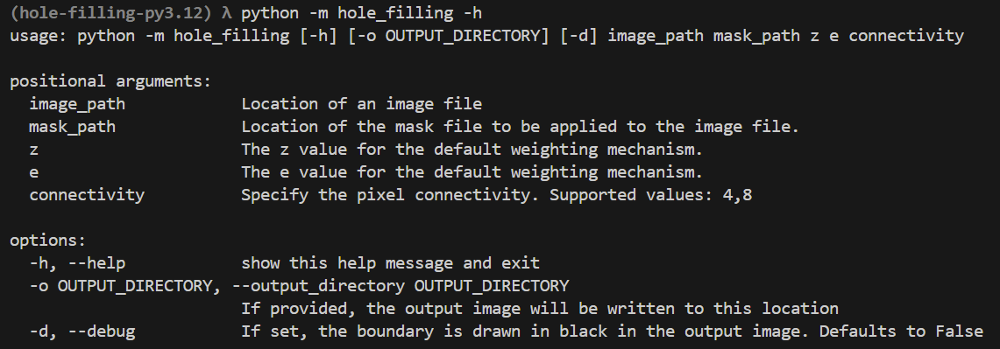

# Hole-Filling

An image processor built using Python and OpenCV that fills holes in images, along
with a simple command line utility.

## Running locally

### Requirements
 - [Python - v3.12](https://www.python.org/)
 - [Poetry - v1.8.3](https://python-poetry.org/)

### Installation

```sh
cd hole-filling
poetry install
```

### Usage



### Example

```sh
python -m hole_filling resources/Lenna.png resources/Mask.png 3 0.01 8
```


## Running in docker

```sh
cd hole-filling
docker build -t hole-filling .
docker run --rm -it -v HOST/PATH:/app/resources:rw hole-filling
```

In the bash shell.. 

```bash
root@c4df36a09865:/app# ls
README.md  hole_filling  poetry.lock  pyproject.toml  q2_flood_fill.py  q3_fmm.py  resources
root@c4df36a09865:/app# python -m hole_filling ./resources/Lenna.png ./resources/Mask.png 3 0.01 8
```

## Additional Implementations

These implementations can be tested locally and within the docker container.

### Flood Fill

A simple flood fill algorithm:
 - iterates through each pixel in the image
 - when a hole is detected
 - calculates the mean value of its neighboring non-hole pixels
 - This value is then assigned as the new value for the hole.
    
This implementation allows configuration of the number of neighboring pixels to consider,
supporting both 4-connected and 8-connected neighbors, with a default setting of 4-connected.

- **Time Complexity**: The algorithm has a time complexity of O(n), where n
is the total number of pixels in the image. Each pixel is processed once,
ensuring efficient traversal.


```sh
python q2_flood_fill.py ./resources/Lenna.png ./resources/Mask.png --connectivity 8
```


### OpenCV - Fast Marching Method

[Fast marching method](https://en.wikipedia.org/wiki/Fast_marching_method) is a
numerical algorithm used for solving problems related to the propagation of a
moving front or wave.  In the context of region filling in images, FMM can be
thought of as simulating how information (e.g., pixel values) spreads from known
regions into unknown regions (holes) in an ordered manner.

Brief Mechanism of Fast Marching in Region Filling:

Initialization:
 - Identify boundary pixels of the hole and label them as known (accepted).
 - Place these boundary pixels in a priority queue (min-heap) based on their initial distance or order of influence.

Propagation:
 - Continuously extract the pixel with the smallest distance (i.e., highest priority) from the queue.
 - Label this pixel as accepted and consider it part of the known region.
 - For each neighboring pixel that is not yet known:
 - Estimate its value based on its surrounding known pixels.
 - Add the pixel to the priority queue with an updated distance value to indicate when it should be processed.

Updating Values:
 - Use neighboring accepted pixel values to compute an approximation of the current pixel's value, typically by averaging or weighted methods.
 - This ensures that the value is smoothly propagated into the hole in a consistent manner.

Completion:
 - The process continues until all pixels in the hole are labeled as accepted and filled with appropriate values.

Key Points:
 - **Priority Queue**: Ensures that pixels are processed in an order that mimics wavefront propagation.
 - **Distance Metric**: Helps determine the order of propagation, ensuring the algorithm fills the region smoothly from the boundaries inward.
 - **Efficiency**: The use of a priority queue gives the method a time complexity of O(nlogn), where n is the number of pixels being processed.

This mechanism results in a natural and efficient way of propagating known values
into unknown areas, ideal for filling holes in images with realistic gradients.

[OpenCV](https://docs.opencv.org/3.4/df/d3d/tutorial_py_inpainting.html#:~:text=Once%20a%20pixel%20is%20inpainted,by%20using%20the%20flag%2C%20cv.) provides built-in support to FMM.

```sh
python q3_fmm.py ./resources/Lenna.png ./resources/Mask.png
```


## Code Quality

### Unittest

Uses pytest for unit-testing

```sh
poetry run pytest
```

### Lint and Formatting

Uses ruff

```sh
poetry run ruff check hole_filling/
poetry run ruff format hole_filling/
```

### Static type checking

Uses mypy

```sh
poetry run mypy hole_filling/
```
